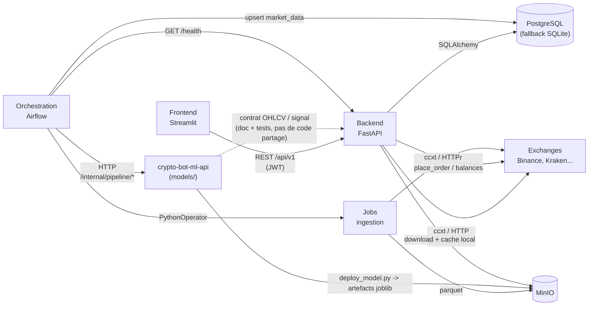

# Interfaces entre services

Statut: reference
Derniere revision: 2026-07-28

Carte de toutes les interfaces documentees entre les services du monorepo
(et avec le repo separe `crypto-bot-models`). Objectif : avoir un seul endroit
qui reponde a "comment ce service parle-t-il a cet autre ?", plutot que de
reconstituer la reponse a partir de fragments epars dans plusieurs docs.

Cette page decrit les contrats tels que documentes ailleurs (endpoints, schemas,
conventions de nommage) ; elle ne les redefinit pas. Si un contrat change dans
le code, la doc source citee en fin de section doit etre mise a jour en premier,
puis ce fichier.

## Vue d'ensemble



Legende : trait plein = appel effectif (reseau ou import) ; trait pointille =
liaison par contrat documente uniquement, sans code partage ni appel direct.

## 1. Frontend (Streamlit) ↔ Backend (FastAPI)

**Mecanisme** : REST `/api/v1` + JWT, via `frontend/src/services/auth_api_client.py`.

- **Auth** : `POST /auth/register, /login, /login/json, /refresh, /logout, /logout-all`
- **Users** : `GET/PUT /users/me`, `GET/PUT /users/me/settings` —
  payload `{exchange, api_key, api_secret, mode: "live"|"sandbox"}`
- **Market** : `POST /market/data/insert`, `GET /market/data/latest/{symbol}`,
  `/market/price/{symbol}`, `/market/symbols`, `/market/indicators/{symbol}`
- **Trading** : `POST/GET/DELETE /trading/orders`, `/trading/portfolio`,
  `/trading/positions` — services sous-jacents encore stub/TODO
- **Strategies** : `GET /strategies/available`, CRUD `/strategies/*`,
  `/strategies/{id}/deploy` — moteur de regles fixes, plus atteignable depuis le
  frontend depuis le passage au catalogue de bots verrouilles (cf. `bots/` ci-dessous
  et `docs/07-bot-strategy-architecture.md` §4.7)
- **Bots** (catalogue verrouille, remplace le flux Strategies cote frontend) :
  `GET /bot-templates`, `GET /bot-templates/{id}`, `GET/POST /user-bots`,
  `POST /user-bots/{id}/start|pause|stop`, `GET /user-bots/{id}/decisions|orders|trades|
  position|performance`, `GET /user-bots/performance-summary`
- **Admin** (reserve `is_admin`) : `GET /users/`, `POST /users/{id}/activate|deactivate|
  make-admin|remove-admin`, `POST /users/purge-inactive` (Airflow, sans auth)
- **Session** : JWT HS256, access 30 min / refresh 7 j, refresh auto toutes
  les 60 s cote frontend

Sources : `backend/README.md`, `docs/05-multi-exchange-layer.md` §2.2-2.3,
`docs/06-testnet-simulation-modes.md` §4.2, `docs/07-bot-strategy-architecture.md` §4.7.

## 2. Backend ↔ Base de donnees

**Mecanisme** : SQLAlchemy 2.0, `backend/src/shared/database/connection.py`
(fallback PostgreSQL → SQLite).

Schema : 13 tables + 4 vues (domaines users, strategie, trading, market_data —
contrainte unique `symbol, exchange, interval, open_time`).

> Incoherence connue : `init_database.sql` est en syntaxe MySQL alors que la
> cible est PostgreSQL — probablement pas le fichier reellement execute.

Sources : `docs/04-architecture-db.md`, `ANALYSE_CRITIQUE.md` §2.4.

## 3. Backend / Jobs ↔ Exchanges

**Mecanisme** : ccxt / HTTP REST.

- **Donnees publiques** : `utils.connectors.exchanges.get_market_data_driver(exchange)
  → MarketDataDriver`, avec `fetch_klines(symbol, interval, limit=1000,
  start_time_ms=None, end_time_ms=None) -> list[dict]`. Contrat OHLCV canonique
  produit par `normalize_ohlcv()` : symbol, interval, source, open_time/close_time
  (UTC), open/high/low/close/volume.
- **Execution authentifiee** : `market/clients/factory.from_user_settings(settings,
  exchange) → ExchangeClient` (ABC `backend/src/market/clients/base.py`).
- **Mode simule/reel** : parametre `sandbox: bool` → `set_sandbox_mode(True)`
  (Binance/OKX/Bybit) ou `params={"validate": True}` (Kraken, pas de testnet Spot).

Sources : `utils/connectors/exchanges/README.md`, `docs/05-multi-exchange-layer.md`
§1-2.2, `docs/06-testnet-simulation-modes.md` §4.3.

## 4. Orchestration (Airflow) ↔ Jobs

**Mecanisme** : import Python direct (meme conteneur), `PythonOperator`.

- Un DAG **par exchange** (`ingest_ohlcv_<exchange>_to_minio`, @hourly, genere
  depuis `INGESTION_TARGETS` dans `orchestration/dags/ingest_ohlcv.py`) :
  `collect_ohlcv()` → `load_ohlcv()` : exchange → MinIO → PostgreSQL
  `market_data` (upsert UUIDv5). Binance et Kraken actifs.
- Connexion `postgres_default` → `postgres:5432/crypto_bot_db`, creee par
  `airflow-init`.

Sources : `orchestration/docs/03-dags.md`.

## 4bis. Orchestration (Airflow) ↔ crypto-bot-ml-api — HTTP, pas d'exécution locale

**Mecanisme** : le DAG `ml_pipeline` (quotidien, 06:00 UTC) appelle
`crypto-bot-ml-api` en HTTP plutot que d'executer `python -m src.main` dans le
conteneur Airflow — `POST /internal/pipeline/features`,
`POST /internal/pipeline/train-rf`. Choix fait pour eviter d'installer les
dependances lourdes de `models/` (torch, scikit-learn, mlflow) dans l'image
Airflow (conflits de versions constates, cf. `04-troubleshooting.md` probleme 8,
resolu).

Sources : `orchestration/dags/ml_pipeline.py`, `orchestration/docs/04-troubleshooting.md`
(probleme 8, resolu), `orchestration/docs/03-dags.md`.

## 5. Backend ↔ Modeles ML — via MinIO, pas d'import direct

**Mecanisme** : artefacts MinIO, aucun appel Python ni HTTP direct entre
`backend/` et `models/`.

- **Flux** : `ml_pipeline` (Airflow, via HTTP, voir §4bis) declenche l'entrainement
  dans `crypto-bot-ml-api` → `jobs/deploy_model.py` copie le meilleur modele vers
  MinIO (`model.joblib, scaler.joblib, feature_columns.json`) →
  `InferenceService` (backend) telecharge au premier appel, cache `/tmp/cryptobot_models/`.
- **Appel interne backend** :
  ```python
  svc = InferenceService(model_name="random_forest")
  result = svc.predict({...})  # -> {"signal": "BUY", "confidence": 0.87, ...}
  ```
- **Endpoints app** : `POST /api/v1/inference/predict` (19 features),
  `GET /api/v1/inference/model`.
- **API propre a `models/`** : FastAPI independante, port 8010 en dev —
  `GET /health`, `GET /models`, `GET /signals/latest`, `POST /predict`.

Sources : `docs/03-architecture-data-ml.md` §4-5, `models/docs/specs/03-contrats-donnees-api.md`.

## 6. Contrat OHLCV — crypto-bot-app ↔ crypto-bot-models (repos separes)

**Mecanisme** : contrat documente + tests de non-regression de chaque cote,
pas de code partage. Niveau "B1" retenu pour l'instant (vs "B2" = paquet
publie `cryptobot-contracts`) — **decision non tranchee**.

Schema partage :

```json
{
  "symbol": "BTCUSDC", "interval": "1h", "open_time": "...Z",
  "open": 60000.0, "high": 60500.0, "low": 59800.0,
  "close": 60200.0, "volume": 123.45, "close_time": "...Z", "source": "binance"
}
```

Convention signal : app SELL=-1, HOLD=0, BUY=1 — modele (ID interne) SELL=0,
HOLD=1, BUY=2 (table de correspondance documentee cote models).

Sources : `docs/08-archi-mutualisation-data-layer.md` §5, `models/docs/specs/02`
et `03`.

## 7. Backend / Jobs ↔ MinIO

**Mecanisme** : client S3-compatible, `utils.connectors.minio.MinioClient`.

Convention de chemin : `crypto-bot-data/raw/ohlcv/{exchange}/{SYMBOL}/{interval}/{date}.parquet`.

> Incoherence connue : variables d'env `MINIO_ACCESS_KEY` vs `MINIO_USER_ADMIN`
> selon les docs.

Sources : `docs/03-architecture-data-ml.md` §2, `docs/08-archi-mutualisation-data-layer.md`
§1, `jobs/README.md`.

## 8. Frontend interne — services ↔ mocks/backend

**Mecanisme** : transition en cours. La majorite des services frontend
appellent encore `mocks/db.py` ; seuls `auth_service.py`/`auth_api_client.py`
parlent reellement au backend.

> Gap : intention de migration documentee, mais pas de plan date et formalise.

Sources : `frontend/README.md` §7, `ANALYSE_CRITIQUE.md` §5.2.

## 9. Healthcheck croise Airflow ↔ Backend

**Mecanisme** : HTTP interne + SQL direct. DAG `cryptobot_health_check` :
`GET http://crypto-bot-backend:8009/health` + `SELECT COUNT(*) FROM orders`
via `PostgresHook`.

Sources : `orchestration/docs/03-dags.md`.
