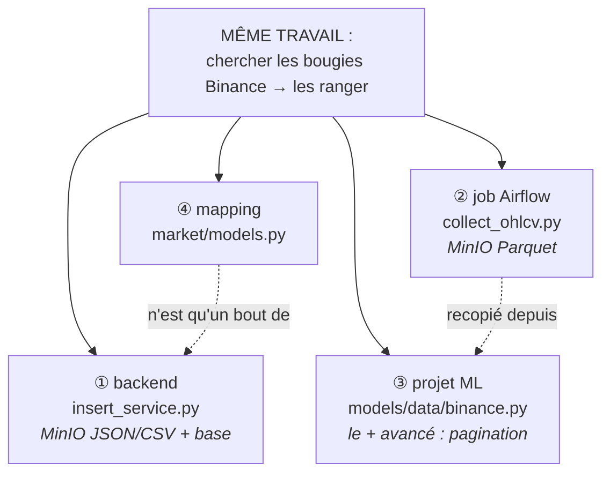
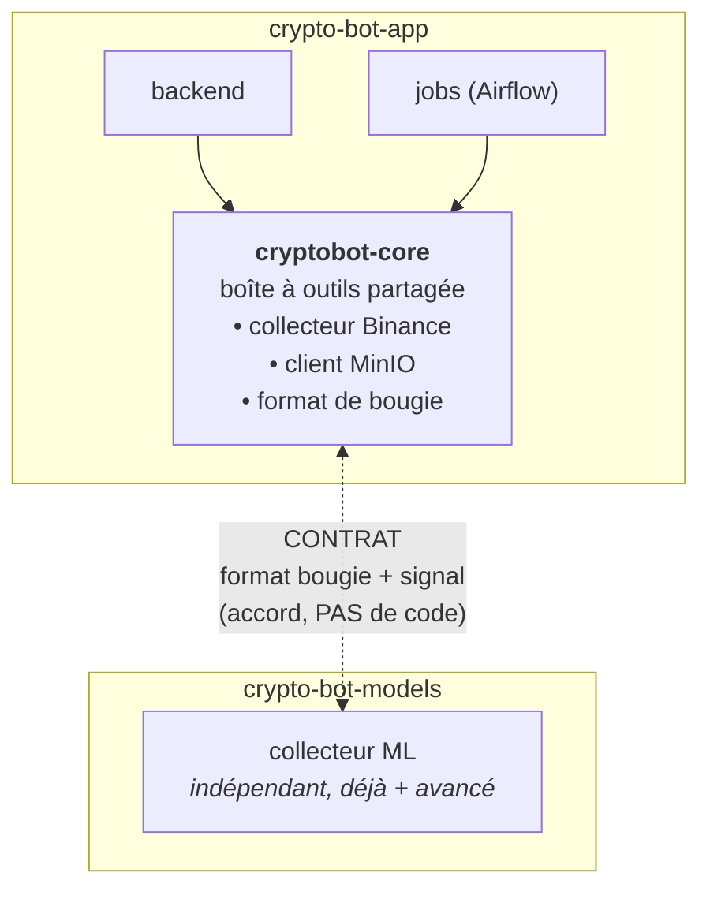
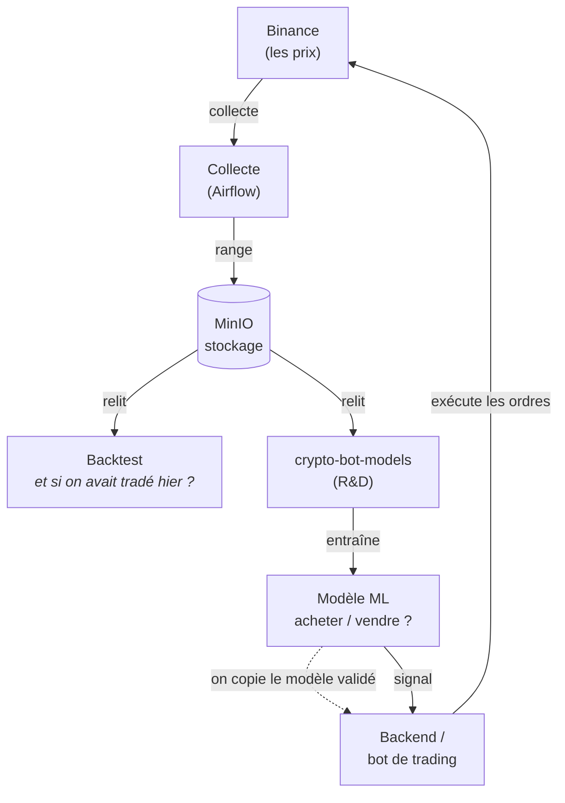

# RFC — Mutualisation de la couche data (clients, collecte, schémas OHLCV)

> **Statut : PROPOSITION — à trancher en équipe** (Nath, Thomas, Lô, Ben)
> Date : 2026-06-09
> Contexte déclencheur : ajout de la couche d'orchestration Airflow (`jobs/` + `orchestration/`),
> qui a fait apparaître une duplication du code de collecte des prix Binance.

---

## 📖 Glossaire — à lire en premier

Ce document parle de données de marché. Voici les mots-clés, expliqués simplement :

| Terme | Explication simple |
|---|---|
| **Bougie / kline** | Un résumé du prix d'une crypto sur une **période** (ex : 1 heure). Sur les graphiques de trading, ça se dessine comme une « bougie ». Une heure = une bougie. |
| **OHLCV** | Les **5 chiffres** qui décrivent une bougie : **O**pen (prix d'ouverture), **H**igh (plus haut), **L**ow (plus bas), **C**lose (prix de clôture), **V**olume (quantité échangée). « Données OHLCV » = des bougies. |
| **Binance** | La plateforme d'échange de cryptos d'où on récupère les prix. Elle expose une **API** (un service web) qui renvoie les bougies. |
| **API** | Une « prise » standardisée pour qu'un programme demande des données à un autre. On appelle l'API de Binance pour obtenir les bougies. |
| **Collecte (ingestion)** | L'action d'aller **chercher** les bougies chez Binance et de les **ranger** chez nous. |
| **MinIO** | Notre « disque dur dans le cloud » (stockage de fichiers, compatible Amazon S3). On y range les bougies collectées. |
| **Parquet / CSV / JSON** | Des **formats de fichier** pour stocker un tableau de données. Parquet = compact et rapide pour l'analyse ; CSV = ouvrable dans Excel ; JSON = lisible à l'œil. |
| **Backtest (test à blanc)** | **Rejouer une stratégie de trading sur des bougies passées** pour voir ce qu'elle aurait gagné ou perdu — **sans risquer d'argent réel**. On répond à : « si on avait suivi cette stratégie le mois dernier, ça aurait donné quoi ? ». C'est pour ça qu'on **garde l'historique des bougies dans MinIO** : il sert de terrain d'essai. |
| **Signal** | La **décision** que produit une stratégie ou un modèle pour une bougie donnée : **acheter** (`1`), **vendre** (`-1`), ou **ne rien faire** (`0`). C'est le « résultat » qu'on cherche, et le format est partagé entre l'app et le projet ML. |
| **Modèle ML / Machine Learning** | Un programme **entraîné sur l'historique des bougies** à reconnaître des situations et à proposer un signal (acheter/vendre/attendre). Fabriqué dans `crypto-bot-models`, puis copié dans l'app une fois validé. |
| **Airflow** | Le **chef d'orchestre** : il déclenche automatiquement nos tâches à heures fixes (ex : « collecte les bougies toutes les heures »), réessaie en cas d'échec, garde un historique. |
| **DAG** | La « recette » que suit Airflow : la liste des étapes d'une tâche et leur ordre. |
| **Job** | Un **script** qui fait un travail précis (ex : collecter les bougies). Airflow lance les jobs. |
| **Client (de code)** | Un bout de code réutilisable qui sait **parler à un service** (un « client Binance » sait appeler Binance ; un « client MinIO » sait ranger des fichiers dans MinIO). |
| **Repo (dépôt)** | Un projet de code versionné avec Git. On en a **trois** (voir ci-dessous). |
| **Schéma de données** | La **liste des colonnes attendues** dans un tableau (ex : une bougie a forcément `open`, `high`, `low`…) et leurs règles. |
| **Contrat** | Un **accord écrit** sur le format des données échangées entre deux projets, pour qu'ils se comprennent **sans partager de code**. (Détaillé plus bas avec une analogie.) |

### Nos 3 projets (repos)

```
crypto-bot-app     → l'application : le site/backend que voient les utilisateurs,
                     + le bot de trading + la nouvelle couche Airflow.
crypto-bot-models  → la R&D Machine Learning : on y entraîne des modèles qui
                     prédisent "acheter / vendre / ne rien faire". Projet à part.
crypto-bot-infra   → la "tuyauterie" (Kubernetes, déploiement). Hors sujet ici.
```

---

## 🎯 TL;DR (résumé en 5 lignes)

L'ajout du job Airflow a révélé que **le même travail — « aller chercher les bougies Binance
et les ranger » — est codé 4 fois** dans nos projets. On propose de **ne pas tout fusionner**,
mais de distinguer **deux cas** :
1. **À l'intérieur de `crypto-bot-app`** (backend + jobs) : on **partage le code**.
2. **Entre `crypto-bot-app` et `crypto-bot-models`** : on **partage juste un contrat** (un accord de format),
   parce que le projet ML veut rester indépendant.

But : passer de **4 collecteurs à 2**, reliés par **1 contrat**.

---

## 1. Le constat : on a écrit 4 fois le même travail

Le « collecter les bougies → les ranger » existe en **4 exemplaires** à travers les projets :

```
                    ┌──────────────────────────────────────────────────────┐
                    │   MÊME TRAVAIL : "chercher bougies Binance → ranger"   │
                    └──────────────────────────────────────────────────────┘
   ① backend            ② job Airflow          ③ projet ML            ④ mapping
   insert_service.py    collect_ohlcv.py       models/data/binance.py  market/models.py
   ───────────────      ────────────────       ─────────────────────   ──────────────
   prend les bougies    prend les bougies      prend les bougies        traduit une bougie
   via python-binance   via requests           via requests (+ avancé:  Binance en objet
   range en MinIO       range en MinIO         pagination, mapping)     "MarketData"
   (JSON+CSV) + base    (Parquet)              range en fichiers locaux
   de données

   ④ est juste un bout de ① · ② a été RECOPIÉ depuis ③ (la docstring le dit)
```

*(même schéma en version graphique — se rend sur GitLab)*



| Capacité | ① backend `crypto-bot-app` | ② job Airflow | ③ `crypto-bot-models` | Remarque |
|---|---|---|---|---|
| **Collecte des bougies** | `market/insert_service.py` | `jobs/ingest/collect_ohlcv.py` | `src/data/binance.py` (**le plus avancé** : pagination, mapping de symboles) | 4 versions ; ② a été **copié** sur ③ |
| **Traduction d'une bougie** | `market/models.py` | `_map_kline` | `map_kline` (+ champs de traçabilité) | ③ détient le **format de référence** |
| **Rangement** | client MinIO (JSON/CSV) | client MinIO (Parquet) | fichiers locaux (+ fiche `.meta.json`) | 3 façons de ranger, 2 destinations |

**Petites incohérences au passage** (à corriger) :
- Les 3 codes ne lisent pas les **mêmes noms de réglages MinIO** (l'un dit `MINIO_USER_ADMIN`, l'autre `MINIO_ACCESS_KEY`…).
- Le job Airflow **refait** ce que le backend savait déjà faire.
- La doc du job pointe vers un fichier `models-training/...` qui **n'existe pas** (le projet s'appelle `crypto-bot-models`).

> **Pourquoi c'est un problème ?** Quand le même travail est codé 4 fois, une correction (ex : Binance
> change son API) doit être faite à 4 endroits. On en oublie un, et les données divergent. C'est de la
> **dette technique**.

---

## 2. Le point clé : le projet ML veut rester indépendant

Bonne nouvelle : `crypto-bot-models` a **écrit noir sur blanc** comment il veut s'intégrer
(`docs/specs/02-architecture-data-ml.md`, § « Intégration avec l'app v2 ») :

> « Le MVP models-training doit **rester indépendant**, puis exposer des **contrats compatibles** :
> même vocabulaire symbole ; OHLCV compatible ; signal `BUY=1, SELL=-1, HOLD=0` ;
> endpoint API consommable par le backend. »

**Traduction :** le projet ML ne veut **pas** dépendre du code de l'app. Il veut juste s'**accorder
sur le format** des données. D'ailleurs, c'est déjà ce que tu décrivais : quand un modèle est validé,
on **copie l'artefact** (le fichier du modèle entraîné) dans l'app — on n'importe pas son code.

### C'est quoi, un « contrat » entre deux projets ? (analogie)

> Imagine deux cuisines (deux projets) qui ne partagent **pas** leurs recettes (leur code), mais qui se
> mettent d'accord sur **le format des plats livrés** : « une commande de bougies, c'est toujours une
> assiette avec ces 5 ingrédients (open, high, low, close, volume), étiquetée avec la date en UTC ».
>
> Chaque cuisine **cuisine à sa façon**, mais le **plat servi est identique**. Tant que les deux
> respectent l'étiquette, elles peuvent évoluer **chacune de leur côté** sans casser l'autre.
>
> Ça, c'est un **contrat** : on partage **le format** (l'étiquette), pas **le code** (la recette).

Donc : **on ne fait PAS importer le code de l'app par le projet ML.** Le lien entre eux, c'est :
1. le **format des bougies** (le contrat OHLCV),
2. la **convention de signal** (acheter = 1, vendre = -1, ne rien faire = 0),
3. l'**artefact modèle** copié + l'**API** qui renvoie le signal.

---

## 3. La proposition : deux cas, deux solutions

```
┌───────────────────────────────────────────────────────────────────────────┐
│  CAS A — DANS LE MÊME PROJET (crypto-bot-app : backend ↔ jobs Airflow)      │
│                                                                             │
│  Problème : ils refont le même travail (① ≈ ②).                            │
│  Solution : on PARTAGE LE CODE.                                            │
│    → on crée une "boîte à outils" commune, `cryptobot-core`,                │
│      que le backend ET les jobs utilisent. On écrit le collecteur UNE fois. │
├───────────────────────────────────────────────────────────────────────────┤
│  CAS B — ENTRE DEUX PROJETS (crypto-bot-app ↔ crypto-bot-models)            │
│                                                                             │
│  Problème : ils manipulent les mêmes bougies, mais le ML veut rester libre. │
│  Solution : on PARTAGE UN CONTRAT (pas le code).                           │
│    → on se met d'accord sur le FORMAT des bougies et du signal.            │
│      Chacun garde son propre code de collecte.                             │
└───────────────────────────────────────────────────────────────────────────┘
```

### Schéma — la cible (qui partage quoi)

```
        ┌──────────────────── crypto-bot-app ─────────────────────┐
        │                                                          │
        │   backend ───┐                          ┌─── jobs        │
        │              │   utilisent tous deux     │   (Airflow)    │
        │              ▼                            ▼               │
        │        ┌─────────────────────────────────────┐          │
        │        │   cryptobot-core  (boîte à outils)    │          │
        │        │   • collecteur Binance (1 seule fois) │          │
        │        │   • client MinIO     (1 seule fois)   │          │
        │        │   • format de bougie (1 seul)         │          │
        │        └─────────────────────────────────────┘          │
        │                          │                                │
        └──────────────────────────┼────────────────────────────────┘
                                    │
                          ~~~ CONTRAT ~~~   (accord de format, PAS de code)
                          format de bougie OHLCV + signal BUY/SELL/HOLD
                                    │
        ┌───────────────────────────┴────────────────────────────┐
        │                  crypto-bot-models                      │
        │   garde SON propre collecteur (déjà plus avancé)        │
        │   produit des bougies au MÊME format → tout le monde     │
        │   se comprend, sans dépendre du code de l'app           │
        └─────────────────────────────────────────────────────────┘
```

*(même schéma en version graphique — se rend sur GitLab)*



### Schéma — le parcours d'une bougie (de Binance jusqu'au trading)

```
   Binance
   (les prix)
      │  on collecte
      ▼
   ┌──────────┐   range    ┌─────────┐   relit     ┌──────────────┐
   │  COLLECTE │ ─────────► │  MinIO   │ ──────────► │  BACKTEST     │  "et si on avait
   │ (Airflow) │            │ (stockage)│            │ (test à blanc)│   tradé hier ?"
   └──────────┘            └─────────┘             └──────────────┘
                                │  relit
                                ▼
                         ┌──────────────┐   entraîne   ┌──────────────┐
                         │ crypto-bot-   │ ───────────► │ MODÈLE ML     │
                         │ models (R&D)  │              │ (acheter/     │
                         └──────────────┘              │  vendre ?)    │
                                                        └──────┬───────┘
                                  on copie le modèle validé    │ signal
                                                                ▼
                                                        ┌──────────────┐
                                                        │ BACKEND /     │  exécute
                                                        │ bot de trading│  les ordres
                                                        └──────────────┘
```

*(même schéma en version graphique — se rend sur GitLab)*



---

## 4. À quoi ressembleraient les dossiers (cible)

> Vocabulaire : on propose de transformer `crypto-bot-app` en **"workspace"** — une façon
> d'organiser le projet en plusieurs **paquets** (`packages/`) qui peuvent se partager une boîte à
> outils commune proprement. (C'est l'objet de l'**issue #10** déjà ouverte.)

```
crypto-bot-app/
├── packages/
│   └── cryptobot-core/              ◀── LA BOÎTE À OUTILS PARTAGÉE (dépendances légères)
│       ├── src/cryptobot_core/
│       │   ├── exchanges/binance/
│       │   │   ├── market_data.py   # chercher les bougies (public)     ← jobs + backend
│       │   │   └── trading.py       # passer des ordres (privé)         ← backend seul
│       │   ├── storage/minio_client.py   # ranger dans MinIO — 1 seule fois
│       │   ├── schemas/ohlcv.py     # LE format de bougie (le contrat, en code)
│       │   └── config.py            # réglages (noms MinIO unifiés)
│       └── tests/{unit,integration} # ses propres tests
│
├── backend/                         # utilise cryptobot-core
│   └── src/tests/{unit,integration,fixtures}
│
├── jobs/                            # utilise cryptobot-core (le collecteur Airflow)
│   └── tests/{unit,integration}
│
├── orchestration/                   # Airflow : les "recettes" (DAGs) + sa doc
│   └── dags/
│
└── frontend/
```

### Et les tests ?

- **Chaque brique a ses propres tests, à côté de son code** (`cryptobot-core/tests`, `backend/.../tests`, `jobs/tests`).
- On sépare :
  - **tests unitaires** = rapides, vérifient un petit bout de logique, sans réseau ;
  - **tests d'intégration** = vérifient le vrai branchement à Binance/MinIO (lancés à part, plus lents).
- **Un test "de contrat"** vérifie que nos bougies respectent bien le format convenu avec le projet ML.
  C'est le **garde-fou** entre les deux projets : si quelqu'un change le format sans prévenir, le test échoue.

---

## 5. Le contrat app ↔ models — à finaliser

Le format de bougie de référence (défini dans `crypto-bot-models/docs/specs/03-contrats-donnees-api.md`) :

```json
{
  "symbol": "BTCUSDT",          // la paire (Bitcoin contre dollar)
  "source_symbol": "BTCUSDT",   // le symbole réellement interrogé chez Binance
  "price_inverted": false,      // a-t-on dû inverser le prix ? (cas BTCETH)
  "interval": "1h",             // la durée d'une bougie (ici 1 heure)
  "open_time": "2026-05-01T00:00:00Z",   // début de la bougie (heure UTC)
  "open": 60000.0, "high": 60500.0, "low": 59800.0, "close": 60200.0,
  "volume": 123.45,
  "close_time": "2026-05-01T00:59:59Z",
  "source": "binance"
}
```
Convention de **signal** : `SELL = -1` (vendre), `HOLD = 0` (ne rien faire), `BUY = 1` (acheter).

**Deux niveaux possibles pour formaliser ce contrat — à choisir ensemble :**

- **(B1) Simple** : on **écrit le contrat dans un document** + un **test** de chaque côté qui vérifie
  qu'on le respecte. Rien à publier. C'est rapide et suffisant pour commencer.
- **(B2) Robuste** : on crée un **mini-paquet partagé** (`cryptobot-contracts`) contenant juste le format,
  publié pour que les 3 projets l'utilisent. Plus solide, mais demande plus de mise en place.

> Bon à savoir : commencer en **B1** n'empêche pas de passer en **B2** plus tard, sans tout refaire.

---

## 6. Pourquoi "workspace" pour le Cas A ? (comparaison rapide)

| Façon de partager le code dans l'app | Avantage | Inconvénient |
|---|---|---|
| **Workspace** (proposé, = issue #10) | imports propres, chaque paquet a ses dépendances, reproductible | un peu de mise en place initiale |
| Simple dossier partagé "bricolé" | rapide | fragile (le bidouillage `sys.path` qu'on a déjà dans le job) |
| Paquet publié tout de suite | très propre | lourd (chaîne de publication à monter) |

Comme l'**issue #10** prévoit déjà de passer en workspace, autant le faire **en même temps** que ce nettoyage.

---

## 7. Ce qu'on doit décider ensemble (ordre du jour)

1. **Périmètre de la boîte à outils `cryptobot-core`** : on confirme **backend + jobs** seulement (le projet ML reste à part) ?
2. **Niveau du contrat** avec le projet ML : **B1** (doc + test) ou **B2** (mini-paquet publié) ?
3. **Mécanisme** : on valide le **workspace** (lié à l'issue #10) ?
4. **Format de référence** : on adopte celui du projet ML (avec `source_symbol`/`price_inverted`) partout ?
5. **Que fait-on de `insert_service.py`** (le vieux collecteur du backend) : on le branche sur `cryptobot-core`, ou on le remplace par le job Airflow ?
6. **Indicateurs / backtesting** (calculs techniques, présents en double) : on les laisse pour l'instant (usages différents) ou on vise une fusion plus tard ?

---

## 8. Esquisse des étapes (une fois décidé — non engageant)

1. Mettre `crypto-bot-app` en workspace.
2. Créer la boîte à outils `cryptobot-core` (collecteur + client MinIO + format de bougie unique),
   en reprenant les bonnes idées du projet ML (pagination, traçabilité).
3. Faire pointer le job Airflow et le backend vers cette boîte commune.
4. Supprimer le bricolage `sys.path` du job, adapter la config Airflow.
5. Unifier les noms de réglages MinIO.
6. Ajouter les tests (unitaires + intégration + contrat).
7. (Si B2) créer et publier le mini-paquet `cryptobot-contracts`.
