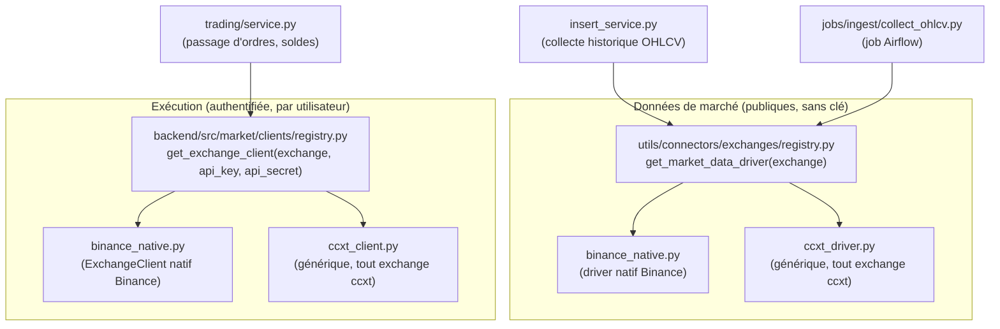

# Couche multi-exchange — clients, API backend, consommation frontend

> Contexte : issue [#13](https://gitlab.com/dst_crypto/Crypto-bot-app/-/issues/13) — sortie de
> Binance du périmètre MiCA (échéance 01/07/2026). Ce document explique **comment fonctionne
> l'abstraction déjà en place** et **comment l'utiliser** (backend ET frontend), pas pourquoi elle
> a été construite ainsi — voir l'issue pour l'historique de décision.

---

## 📖 Glossaire — les deux couches à ne pas confondre

| Terme | Explication |
|---|---|
| **Driver de données de marché** | Va chercher des prix/bougies **publics**, sans clé API (`utils/connectors/exchanges/`). Utilisé pour la collecte historique et l'ingestion. |
| **Client d'exécution** | Parle au compte d'un **utilisateur** : soldes, ordres — nécessite ses clés API (`backend/src/market/clients/`). |
| **ccxt** | Librairie tierce qui parle nativement à des dizaines d'exchanges (Binance, Kraken, ...) avec une API unifiée. C'est le chemin **par défaut** des deux couches. |
| **Driver/client natif** | Implémentation écrite à la main pour un exchange précis (ex: `binance_native.py`), utilisée seulement si ccxt gère mal un cas particulier. C'est la **trappe**, l'exception. |
| **Registry** | Le "standardiste" : on lui donne un nom d'exchange (`"kraken"`), il retourne l'objet driver/client prêt à l'emploi — natif si enregistré, sinon ccxt. |
| **Symbole canonique** | Notre format interne, ex: `BTCUSDT`, `BTCEUR` — indépendant de la syntaxe propre à chaque exchange (`BTC/USDT` chez ccxt). |

---

## 1. Vue d'ensemble

Deux abstractions **distinctes et parallèles**, qui ne se mélangent jamais :



**Règle simple** : si le code a besoin d'une clé API utilisateur → couche exécution
(`backend/src/market/clients/`). Sinon (juste des prix) → couche données de marché
(`utils/connectors/exchanges/`).

---

## 2. Côté backend — comment consommer chaque couche

### 2.1 Données de marché (ex: `insert_service.py`)

```python
from utils.connectors.exchanges import get_market_data_driver

driver = get_market_data_driver(exchange)          # "binance", "kraken", ... résolu par le registry
rows = driver.fetch_klines(
    symbol, interval,
    limit=limit,
    start_time_ms=..., end_time_ms=...,
)
# rows: list[dict] déjà normalisé — mêmes clés quel que soit l'exchange source
# {"symbol": "BTCEUR", "source": "kraken", "open_time": datetime, "open": float, ...}
```

Aucun accès direct à `python-binance`, à `ccxt`, ni aux index positionnels d'un kline brut.
Le contrat est défini dans `utils/connectors/exchanges/base.py` (`MarketDataDriver` Protocol +
`normalize_ohlcv()`).

### 2.2 Exécution (ex: `trading/service.py`)

```python
from market.clients.factory import from_user_settings

client = from_user_settings(current_user.settings, exchange="kraken")
balances = client.get_balances()                    # list[Balance]
order = client.place_order(symbol, side, order_type, quantity, price)  # OrderResult normalisé
```

Le contrat est défini dans `backend/src/market/clients/base.py` (`ExchangeClient` ABC +
dataclasses `Balance` / `Ticker` / `OrderResult`).

`PUT /users/me/settings` accepte des champs génériques `exchange` / `api_key` / `api_secret`
(le paramètre `exchange` défaute à `"binance"` côté service si omis, pour compatibilité) :

```json
PUT /users/me/settings
{ "exchange": "kraken", "api_key": "...", "api_secret": "..." }
```

La réponse de `GET`/`PUT /users/me/settings` expose `configured_exchanges: list[str]` (les
exchanges pour lesquels l'utilisateur a enregistré des clés), au lieu d'un booléen unique
`has_binance_credentials`.

### 2.3 API REST exposée au frontend

`POST /market/data/insert` et `GET /market/data/latest/{symbol}` acceptent désormais un champ
`exchange` (défaut `"binance"` pour compatibilité) :

```json
POST /market/data/insert
{
  "exchange": "kraken",
  "symbol": "BTCEUR",
  "interval": "1h",
  "start_time": "2026-01-01T00:00:00Z",
  "limit": 500
}
```

```
GET /market/data/latest/BTCEUR?interval=1h&periods=100&exchange=kraken
```

---

## 3. Côté frontend — comment c'est consommé

Le frontend est migré (cf. commit associé) : plus aucune référence à `"binance"` en dur dans
`frontend/src/` en dehors des valeurs par défaut et du catalogue d'exchanges proposés.

### Sélection de l'exchange

`utils/constants.py` définit le catalogue proposé dans l'UI :

```python
EXCHANGE_CATALOG: dict[str, str] = {"binance": "Binance", "kraken": "Kraken"}
DEFAULT_EXCHANGE = "binance"
```

La page **Gestion de compte** (`pages/07_Gestion_de_compte.py`) affiche un vrai sélecteur
(`st.selectbox`) au-dessus du formulaire de clés API. La sélection est mémorisée en session
(`state/session.py:get_selected_exchange` / `set_selected_exchange`) — pas encore persistée côté
backend (pas de colonne dédiée sur `UserSettings`, cf. section 4).

### Enregistrer des clés pour un exchange

```python
# frontend/src/services/account_service.py
def save_exchange_credentials(self, payload: ExchangeCredentialInput) -> tuple[bool, str]:
    response = self.client.update_user_settings(
        access_token=self._token(),
        exchange=payload.exchange,                # "binance" | "kraken" | ...
        api_key=payload.api_key.strip(),
        api_secret=payload.api_secret.strip(),
    )
    ...
```

### Lire le statut de configuration pour l'exchange sélectionné

```python
# frontend/src/services/account_service.py
def get_exchange_status(self, exchange: str) -> ExchangeCredentialStatus:
    response = self.client.get_user_settings(self._token())
    configured = exchange in (response.data.get("configured_exchanges") or [])
    ...
```

### Lister, modifier, supprimer ses clés (tous exchanges confondus)

La section "Mes clés API enregistrées" de la page Gestion de compte liste **tous** les exchanges
pour lesquels l'utilisateur a des clés, indépendamment de l'exchange actuellement sélectionné —
un utilisateur peut avoir des clés Binance **et** Kraken en même temps (vérifié : chaque
sauvegarde n'écrit que la clé de son propre exchange dans `UserSettings.api_keys`, sans toucher
aux autres). Suppression via clés vides (le backend interprète `api_key=""` + `api_secret=""`
comme une demande de suppression pour cet exchange) :

```python
# frontend/src/services/account_service.py
def list_configured_exchanges(self) -> list[str]:
    ...  # lit configured_exchanges depuis GET /users/me/settings

def delete_exchange_credentials(self, exchange: str) -> tuple[bool, str]:
    response = self.client.update_user_settings(token, exchange=exchange, api_key="", api_secret="")
    ...
```

### Visualiser le portefeuille quel que soit l'exchange

`services/portfolio_service.py` lit l'exchange actif via `get_selected_exchange()` et le propage
dans `SystemStatus.exchange` — la page `03_Portefeuille_Spot.py` affiche alors un badge de statut
libellé dynamiquement (`snapshot.system_status.exchange.capitalize()`) au lieu d'un badge
"Binance" figé. Le système de pré-requis (`prerequisites/exchange.py`,
`components/prerequisites.py`) bloque/dégrade les pages Portefeuille, Performances, Contrôle et
Paramétrage bot tant que l'exchange sélectionné n'a pas de clés configurées — même mécanisme
qu'avant, généralisé.

---

## 4. Ce qui reste à faire (voir issue #13)

- [ ] **Action infra requise avant le prochain déploiement** : `backend/src/shared/config/security.py`
      lit désormais `EXCHANGE_ENC_KEY` (renommé depuis `BINANCE_ENC_KEY` — chiffre les clés de
      tous les exchanges, pas seulement Binance). Ce repo (compose, `.env.example`, docs) est à
      jour, mais le secret déployé dans `crypto-bot-infra` (`overlays/{dev,staging,production}/secrets.yaml`,
      `scripts/rotate_secrets.sh`) est encore nommé `BINANCE_ENC_KEY` — à renommer/re-seller
      **côté infra avant de déployer cette version**, sous peine de `RuntimeError` au démarrage
      (variable manquante).
- [ ] Persister la sélection d'exchange côté backend (aujourd'hui en session frontend
      uniquement — perdue au reload). Nécessiterait une colonne sur `UserSettings` ou un champ
      dédié dans `api_keys`.
- [ ] Gestion des clés API via SOPS (aucun secret en clair dans le repo — indépendant du
      chiffrement applicatif déjà en place via `encrypt_secret`/`decrypt_secret`).
- [x] `insert_service.py` : migré — utilise `get_market_data_driver`, plus aucun accès direct à
      `ClientBinance`.
- [x] Relabeling frontend : plus de `"binance"` codé en dur ; sélecteur d'exchange fonctionnel
      dans Gestion de compte.
- [x] Endpoint `PUT /users/me/settings` généralisé (`exchange`/`api_key`/`api_secret`).

## 5. Tests de référence

- `backend/src/tests/unit/test_market_clients_execution.py` — couche exécution (`quotes`,
  `ccxt_client`, `binance_native`, `registry`, `factory`).
- `utils/tests/test_ccxt_driver.py`, `test_binance_native.py`, `test_registry.py`, `test_base.py`
  — couche données de marché.
- `backend/src/tests/unit/test_insert_service.py` — orchestration collecte → MinIO → DB,
  driver et session DB mockés.
- `backend/src/tests/integration/test_user_service.py` — `configured_exchanges` sur
  `export_user_data`.
- `frontend/tests/unit/test_exchange_prerequisite.py`, `test_account_service.py` — pré-requis
  d'exchange et sauvegarde/lecture des credentials par exchange.
- `frontend/tests/smoke/test_pages_smoke.py` — pages Streamlit rendues sans exception avec/sans
  exchange configuré.
