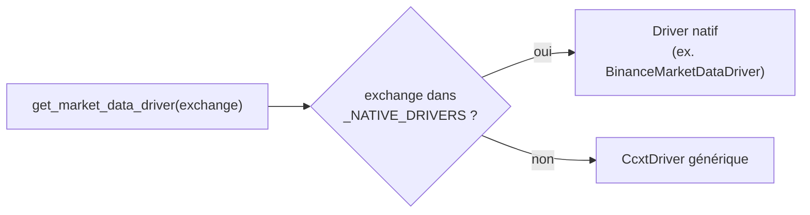
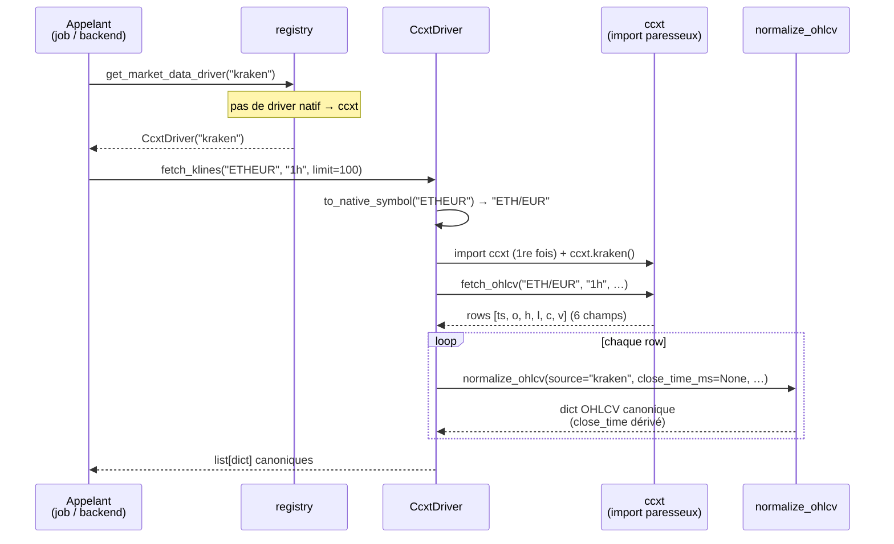

# `utils.connectors.exchanges` — drivers de données de marché multi-exchange

Statut: référence
Derniere revision: 2026-07-02

Couche **pluggable** pour collecter des données de marché (OHLCV) depuis n'importe quel
exchange, via une **interface commune**. Données **publiques** uniquement (prix/klines) :
aucune clé API requise. Réutilisable par tous les niveaux (`jobs`, `models`, backend) —
ce package **ne dépend d'aucune couche applicative**.

> Contexte : sortie de Binance (MiCA) → l'app doit supporter plusieurs exchanges
> (Binance, Kraken, …). Voir l'issue #13 et le plan multi-exchange.

## Le contrat : `MarketDataDriver` + `normalize_ohlcv`

Tout driver respecte le `Protocol` `MarketDataDriver` (`base.py`) :

```python
def fetch_klines(symbol, interval, limit=1000, start_time_ms=None, end_time_ms=None) -> list[dict]
```

- `symbol` est **canonique** (style app, ex. `BTCUSDT`) — c'est ce qui est stocké en base.
  Chaque driver traduit vers/depuis sa forme native (ex. ccxt attend `BTC/USDT`).
- Le retour est une liste de **dicts OHLCV canoniques** produits par `normalize_ohlcv`.

### Le dict OHLCV canonique (`normalize_ohlcv`)

Un seul normaliseur, partagé par tous les drivers → la forme du dict est définie **à un seul endroit**.

| Clé | Type | Note |
|-----|------|------|
| `symbol` | str | mis en majuscules |
| `interval` | str | ex. `1h` |
| `source` | str | **paramétré** par driver (`binance`, `kraken`, …) |
| `open_time` / `close_time` | `datetime` (UTC) | pas des millisecondes |
| `open` / `high` / `low` / `close` / `volume` | float | |
| `quote_asset_volume`, `number_of_trades`, `taker_buy_base_volume`, `taker_buy_quote_volume` | float / int / `None` | extras optionnels |

**Dérivation de `close_time`** : certains drivers (ccxt) ne fournissent pas `close_time`.
Quand `close_time_ms` est absent, il est **calculé** : `open_time + durée(interval) - 1 ms`
(une bougie 1h ouverte à 10:00:00 ferme à 10:59:59.999). La colonne DB `close_time` étant
non-nullable, cette dérivation est indispensable.

## Le registry : trappe native + ccxt par défaut

`get_market_data_driver(exchange)` (`registry.py`) applique la règle :

- **driver natif si enregistré** dans `_NATIVE_DRIVERS` (ex. Binance : garde le payload riche
  à 11 champs via l'API REST publique) ;
- **sinon `CcxtDriver`** (générique, couvre Kraken et ~100 autres exchanges).

```python
from utils.connectors.exchanges import get_market_data_driver

driver = get_market_data_driver("kraken")          # -> CcxtDriver
rows = driver.fetch_klines("ETHEUR", "1h", limit=100)
```

Résolution du driver :



## Flux d'un `fetch_klines` via ccxt

Cas `get_market_data_driver("kraken")` puis `fetch_klines("ETHEUR", "1h")` :



Le driver **natif** (Binance) suit le même flux, sauf qu'il appelle l'API REST publique
(`requests`) au lieu de ccxt et fournit directement les 11 champs (dont `close_time`).

## ➕ Ajouter un exchange

**Cas courant — rien à écrire.** Si ccxt supporte l'exchange, il passe automatiquement par
`CcxtDriver` :

```python
get_market_data_driver("kraken")   # marche déjà, aucun code à ajouter
```

**Cas payload riche / comportement spécifique** — écrire un driver natif et l'enregistrer :

1. Créer `mon_exchange_native.py` avec une classe exposant `source: str` et `fetch_klines(...)`
   (qui appelle `normalize_ohlcv(..., source="mon_exchange")`).
2. L'enregistrer dans `registry.py` :
   ```python
   _NATIVE_DRIVERS = {
       "binance": BinanceMarketDataDriver,
       "mon_exchange": MonExchangeDriver,   # <-- 1 ligne
   }
   ```

Pas besoin d'hériter du `Protocol` : le typage est **structurel** (une classe qui a `source`
+ `fetch_klines` « est » un `MarketDataDriver`).

## Contrainte : import ccxt **paresseux**

`import ccxt` se fait **dans `CcxtDriver._get_client`**, jamais au niveau module. Raison :
`models/` importe `utils.connectors.minio` mais **n'a pas ccxt** dans ses dépendances.
Importer le registry (ou résoudre un driver) ne doit donc **pas** charger ccxt tant qu'on
ne `fetch` pas réellement. À préserver si tu ajoutes un driver ccxt-based.

## Tests

Rangés dans `utils/tests/`, lancés par `make test-utils` (`PYTHONPATH=.`).

- **Unitaires** (par défaut, hors-ligne, déterministes) : on n'appelle jamais le réseau.
  - `CcxtDriver` : injecter un faux client → `driver._client = FakeClient()`.
  - `binance_native` : remplacer `requests.get` via `monkeypatch.setattr(bn.requests, "get", ...)`.
- **Intégration** (réseau réel, *opt-in*) : marquée
  `@pytest.mark.skipif(not os.getenv("RUN_INTEGRATION"), ...)`, donc **skippée** par défaut.
  Pour la lancer : `RUN_INTEGRATION=1 PYTHONPATH=. pytest utils/tests/test_ccxt_driver.py`.

## Fichiers

| Fichier | Rôle |
|---------|------|
| `base.py` | `MarketDataDriver` (Protocol) + `normalize_ohlcv` + `interval_to_timedelta` |
| `binance_native.py` | Driver Binance natif (REST public, payload riche 11 champs) |
| `ccxt_driver.py` | Driver générique ccxt (import paresseux, traduction de symbole) |
| `registry.py` | `get_market_data_driver` (trappe native + ccxt par défaut) |
